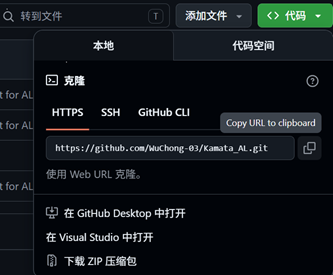

# AL科目：Git / Fork / GitHub 提交流程笔记

**本地仓库负责记录开发过程，远程仓库负责提交与共享，Tag 负责指定要判定的 commit。**

---

## 1. 使用git提交/修改项目流程

### 1.1 首先提交自己的仓库链接

在 GitHub 网站仓库页面：

```text
Code
↓
HTTPS
↓
复制 URL
```


### 1.2 提交到仓库

commit -- push


### ex 与课题顺序的补充

`ex` 是扩展内容，课堂上可以根据担当教员的指示跳过。通常比单纯基础题更接近实际开发.  
不建议为了强行配合题号而倒回去修改旧内容, Git 操作难度会变高，弄错后可能导致严重问题

```text
03_08
↓
03_08_ex1
↓
03_09
```


---

### 1.3.添加Tag

`Tag` 是 Git 中给某个特定 `commit` 打上的标签。

它的作用是明确告诉老师或AI作业判定系统：**这个 commit 是我要提交 / 判定的版本。**

目前来说,tag是这边ai采点系统必须的

```
编写代码
↓
commit push
↓
在“完成作业的那条 commit”上创建 Tag 并提交 
```
```
commit 8：修正注释
commit 7：完成 04_02 课题        ← 打 Tag：AL2_04_02
commit 6：测试移动逻辑
commit 5：整理文件
commit 4：完成 04_01 课题        ← 打 Tag：AL2_04_01
commit 3：修复错误
commit 2：添加素材
commit 1：initial commit
```

---

### 1.4 如何修改作业

修正后必须进行：

```text
删除本地和远程旧 Tag
↓
在修正后的 commit 上重新创建同名 Tag 并 push
```

---

## 2. fork相关操作

### 2.1 Fork 中创建本地仓库

```text
File
↓
Init New Repository...
↓
选择项目根文件夹
↓
创建本地仓库
```

这里选择的文件夹是项目的根文件夹，也就是包含 `.gitignore`、项目文件夹、资源文件夹等内容的**最外层文件夹**。

---

## 2.3 初始提交 Initial Commit

创建本地仓库之后，暂时还没有 commit 历史。

需要先做一个初始提交：

```text
Initial Commit
```

课件中建议先只选择 `.gitignore`，然后进行第一个 commit。

流程：

```text
Local Changes
↓
从 Unstaged 中选择 .gitignore
↓
Stage
↓
输入 commit message：Initial Commit
↓
Commit
```

### 12.1 Staged 和 Unstaged

| 状态 | 含义 |
|---|---|
| Unstaged | 还没有放入本次提交的修改 |
| Staged | 已经准备放入本次提交的修改 |

`Stage` 的意思是：把文件加入下一次 commit 的候选内容。

---

### 12.2 Initial Commit 后的结果

完成 Initial Commit 后，可以在 `All Commits` 中看到提交记录。

此时通常只有一个 commit。

之后再继续把其他文件 stage、commit、push。

---

## 13. 创建远程仓库

### 13.1 远程仓库是什么

`远程仓库` 是 GitHub 上的仓库。

简单说：

```text
本地仓库 = 自己电脑里的仓库
远程仓库 = GitHub 上的仓库
```

以后会一直使用这个远程仓库提交 AL 课题，所以一开始要决定好仓库名。

---

### 13.2 GitHub 上创建远程仓库

在浏览器中打开 GitHub，登录后：

```text
右上角 +
↓
New Repository
↓
输入 Repository name
↓
选择 Private
↓
Create repository
```

课件中使用的是 `Private repository`。

仓库名不一定必须和本地文件夹名完全一致，但因为这是别人看到的远程仓库名，所以要认真命名。

---

### 13.3 Private 仓库的注意点

如果远程仓库是 `Private`，老师或协作者无法直接看到，需要把担当教员加入 collaborator。

课件中要求：

```text
Visibility 设为 private
邀请授课担当教员作为 collaborator
```

如果使用 private 仓库，还需要 SSH 认证设置，具体参考课程的 SSH 资料。

---

## 14. 本地仓库和远程仓库连接

本地仓库创建后，还需要和 GitHub 上的远程仓库连接。

这一步叫设置 `remote`。

### 14.1 在 Fork 中添加 Remote

在 Fork 左侧：

```text
Remotes
↓
右键
↓
Add New Remote...
```

然后在 GitHub 仓库页面复制远程仓库地址。

### 14.2 SSH 与 HTTPS

GitHub 上可以复制：

- HTTPS 地址
- SSH 地址

课件中说明：

- 如果远程仓库是 public，HTTPS 也可以
- 如果远程仓库是 private，通常需要使用 SSH

流程：

```text
GitHub 仓库页面
↓
Code
↓
SSH
↓
复制地址
↓
Fork 的 Add Remote 中粘贴
↓
Add New Remote
```

常见 remote 名称是：

```text
origin
```

---

## 15. Push：上传到 GitHub

连接 remote 后，就可以 push。

Push 的意思是：

```text
把本地 commit 上传到远程仓库 GitHub
```

在 Fork 中：

```text
Push
↓
确认 branch 是 master
↓
确认推送目标是 origin/master
↓
Push
```

Push 选项通常保持默认即可。

如果勾选 `Push all tags`，Tag 也会一起推送到 GitHub。

---

## 16. Commit 与 Push 的关系

### 16.1 Commit

`commit` 是保存到本地仓库。

```text
commit = 保存一次本地修改记录
```

commit 后，本地 Git 历史会更新，但 GitHub 上还不一定有。

---

### 16.2 Push

`push` 是上传到远程仓库。

```text
push = 把本地 commit 上传到 GitHub
```

如果只 commit 不 push，老师在 GitHub 上看不到你的最新修改。

---

### 16.3 关系总结

```text
编辑文件
↓
stage
↓
commit
↓
push
```

更简单地记：

```text
commit 是存到自己电脑
push 是传到 GitHub
```

---

## 17. Visual Studio 与 Fork 的配合

Visual Studio 也可以进行 Git 操作，Fork 也可以进行 Git 操作，二者可以并用。

课程建议：

- 继续在 Visual Studio 中写代码
- 可以在 Visual Studio 中 commit / push
- Git 的整体状态、分支树、提交历史建议在 Fork 中确认

原因是：团队制作时分支可能会变复杂，Visual Studio 不一定容易看清整体结构，而 Fork 的 Git tree 更直观。

简单理解：

```text
Visual Studio：主要写代码
Fork：主要看 Git 历史、分支、Tag、Remote
GitHub：远程提交、课题提出、老师确认
```

---

## 18. 最重要的流程总结

### 18.1 初次创建项目流程

```text
准备项目文件夹
↓
Fork：Init New Repository
↓
生成 .git
↓
Stage .gitignore
↓
Initial Commit
↓
GitHub 创建 Private Repository
↓
Fork 添加 Remote
↓
Push
```

### 18.2 平时开发流程

```text
master 分支上编辑
↓
完成一个小任务
↓
stage
↓
commit
↓
push
```

### 18.3 课题提交流程

```text
完成课题
↓
commit
↓
push
↓
给完成版本的 commit 创建 Tag
↓
push Tag
↓
提交 GitHub 仓库 URL
```

### 18.4 修正后重新提交流程

```text
收到指摘
↓
修改代码
↓
commit
↓
push
↓
删除旧 Tag
↓
勾选 Delete tag from remote repositories
↓
在修正后的 commit 上重新创建同名 Tag
↓
勾选 Push
↓
Create and Push
```

### 18.5 为什么必须移动 Tag

```text
AI 判定 / 老师确认看的不是“最新代码”，而是 Tag 指向的 commit。
```

所以如果修正后不重新打 Tag，判定对象仍然可能是旧版本。

---

## 19. 关键词整理

| 日语 / 英语 | 中文 | 理解 |
|---|---|---|
| Git | Git | 版本管理系统 |
| Fork | Fork | Git 图形客户端 |
| repository | 仓库 | 保存项目代码和历史记录的地方 |
| local repository | 本地仓库 | 自己电脑里的 Git 仓库 |
| remote repository | 远程仓库 | GitHub 上的仓库 |
| .git | Git 管理文件夹 | 记录 Git 历史、分支、remote 等信息 |
| .gitignore | 忽略文件配置 | 指定哪些文件不交给 Git 管理 |
| stage | 暂存 | 把文件加入下一次提交 |
| unstaged | 未暂存 | 修改了但还没加入提交 |
| staged | 已暂存 | 已准备加入下一次提交 |
| commit | 提交 | 保存一次当前代码状态 |
| initial commit | 初始提交 | 第一次提交 |
| push | 推送 | 把本地提交上传到 GitHub |
| master | master 分支 | 课程中主要编辑使用的默认分支 |
| branch | 分支 | 用来分开开发线的 Git 功能 |
| remote | 远程连接 | 本地仓库和 GitHub 仓库之间的连接 |
| origin | origin | 常见的远程仓库名称 |
| HTTPS | HTTPS 地址 | GitHub 仓库地址的一种 |
| SSH | SSH 地址 | private 仓库常用的连接方式 |
| collaborator | 协作者 | 被邀请进入 private 仓库的人 |
| Tag | 标签 | 给指定 commit 打上的标记 |
| New Tag | 新建 Tag | 在某个 commit 上创建标签 |
| Create and Push | 创建并推送 | 创建 Tag 后同时上传到 GitHub |
| Delete Tag | 删除 Tag | 删除已有标签 |
| Delete tag from remote repositories | 从远程仓库删除 Tag | 删除 GitHub 上的远程 Tag |
| 指摘 | 指出问题 | 老师或系统指出需要修改的地方 |
| 差し替え | 替换 | 把旧 Tag 换到新的修正 commit 上 |

---

## 20. 一句话总结

AL 科目的 Git 学习重点是：用 Fork 创建和管理本地仓库，用 GitHub 创建远程仓库，用 Remote 把两者连接起来，平时通过 `commit → push` 保存和上传进度，课题判定时用 `Tag` 指定要检查的 commit。修正后必须删除旧 Tag，并在修正后的 commit 上重新创建同名 Tag。
